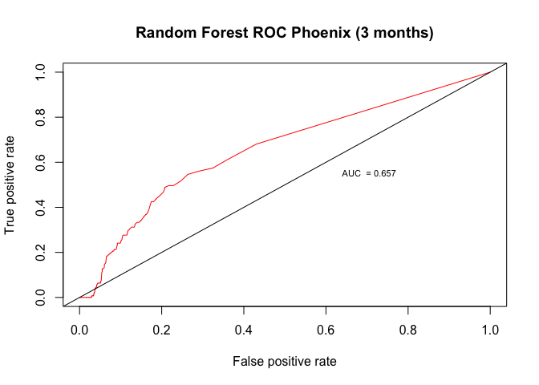

Forecasting Event Data
================
Zhanna Terechshenko
10/27/2017

### Introduction

In this tutorial, I compare forecasting utility of PHOENIX and ICEWS event datasets using the output from the random forest model.

Loading libraries:

``` r
rm(list=ls())
library(here)
library(caret)
library(stats)
library(plyr)
library(data.table)
library(tidyverse)
library(randomForest)
library(ROCR)
```

Making sure the results of this script are reproducible

``` r
set.seed(0927)
```

In order to compare forecasting utility I am using The Ground Truth Data Set (GTDS), which provides information on 5 events of interests (EOI): International Crisis, Ethnic/Religious Conflict, Domestic Crisis, Rebellion, and Insurgency. It covers 168 states from January 2001 through 2014. The unit is country-month.

``` r
eoi = read.csv("gtds_2001.to.may.2014.csv")
head(eoi)
```

    ##   ccode country year month   time ins reb dpc erv ic notes
    ## 1    20  Canada 2001     1 2001m1   0   0   0   0  0      
    ## 2    20  Canada 2001     2 2001m2   0   0   0   0  0      
    ## 3    20  Canada 2001     3 2001m3   0   0   0   0  0      
    ## 4    20  Canada 2001     4 2001m4   0   0   0   0  0      
    ## 5    20  Canada 2001     5 2001m5   0   0   0   0  0      
    ## 6    20  Canada 2001     6 2001m6   0   0   0   0  0      
    ##               coder insnotes dpcnotes rebnotes ervnotes icnotes
    ## 1 Bentley & Leonard                                            
    ## 2 Bentley & Leonard                                            
    ## 3 Bentley & Leonard                                            
    ## 4 Bentley & Leonard                                            
    ## 5 Bentley & Leonard                                            
    ## 6 Bentley & Leonard

Here, I'll focus on on International Crisis. For the purpose of forecasting I create an onset variable:

``` r
eoi_int = eoi %>%
  select(ccode, year, month, ic) # select int'l crisis variable

eoi_d = eoi_int[eoi_int$ic==1,] #choose country-month with int'l crisis
eoi_d$onset <- with(eoi_d, ave(year, month, ccode, FUN = function(x)
  as.integer(c(TRUE, tail(x, -1L) != head(x, -1L) + 1L))))
eoi_d = eoi_d[eoi_d$onset==1,] # create an onset variable based on the val

eoi_final = merge(eoi_int, eoi_d, all.x=T) # add onset variable to original dataset
eoi_final$onset[is.na(eoi_final$onset)==T] <-0
eoi_final$ic = NULL
```

I've already preprocessed both PHOENIX and ICEWS (pho\_processing.R and Icews\_processing.R scripts in the repository). I aggregated both datasets to the country - month level and selected conflicts with government and military actors for international conflict. In this aggregated form, both datasets provide information on counts of events for quad classes: verbal cooperation, material cooperation, verbal conflict, material conflict.

``` r
phoenix_int = read.csv("pho_international.csv")
head(phoenix_int)
```

    ##   X ccode year month vcp mcp vcf mcf
    ## 1 1   100 2001     2   3   0   0   0
    ## 2 2   100 2001     4   1   0   0   0
    ## 3 3   100 2001     5   2   0   0   0
    ## 4 4   100 2001     6   6   0   0   0
    ## 5 5   100 2001     7   1   0   1   0
    ## 6 6   100 2001     9   1   0   0   1

I lag quad categories by 3 and 6 months

``` r
pho_int_lag = phoenix_int %>% 
  group_by(ccode) %>% 
  arrange(ccode, year) %>% 
  do(data.frame(., setNames(shift(.$vcp, c(3,6)), paste("vcp_l", c(3,6), sep=".")))) %>%
  do(data.frame(., setNames(shift(.$mcp, c(3,6)), paste("mcp_l", c(3,6), sep=".")))) %>%
  do(data.frame(., setNames(shift(.$vcf, c(3,6)), paste("vcf_l", c(3,6), sep=".")))) %>%
  do(data.frame(., setNames(shift(.$mcf, c(3,6)), paste("mcf_l", c(3,6), sep=".")))) %>%
  select(ccode, year, month, vcp_l.3, mcp_l.3, vcf_l.3, mcf_l.3,
         vcp_l.6, mcp_l.6, vcf_l.6, mcf_l.6)

pho_int_lag = na.omit(pho_int_lag)
```

Finally, I merge GTDS and PHOENIX datasets together

``` r
df = merge(pho_int_lag, eoi_final, by=c("ccode", "year", "month"))
df$onset = as.factor(df$onset)
```

I split the data on training and test samples. In this example, I train the model on 2001 - 2005 data and test it on 2006:

``` r
train_data = df[which(df$year<=2005),]
train_data_l3 = subset(train_data, select=c("ccode", "year", "month",
                                            "vcp_l.3", "mcp_l.3", "vcf_l.3", "mcf_l.3", 'onset'))
train_data_l6 = subset(train_data, select=c("ccode", "year", "month",
                                            "vcp_l.6", "mcp_l.6", "vcf_l.6", "mcf_l.6", 'onset'))


test_data = df[which(df$year==2006),]
test_data_l3 = subset(test_data, select=c("ccode", "year", "month",
                                            "vcp_l.3", "mcp_l.3", "vcf_l.3", "mcf_l.3", 'onset'))
test_data_l6 = subset(test_data, select=c("ccode", "year", "month",
                                            "vcp_l.6", "mcp_l.6", "vcf_l.6", "mcf_l.6", 'onset'))
```

I train the model using random forest and 5-fold cross validation.

``` r
fitControl=trainControl(method="cv",number=5)

rf_model<-train(onset~.,data=train_data_l3,method="rf",
                trControl=fitControl,allowParallel=TRUE,
                savePredictions = TRUE, verbose=F)

print(rf_model)
```

    ## Random Forest 
    ## 
    ## 5273 samples
    ##    7 predictor
    ##    2 classes: '0', '1' 
    ## 
    ## No pre-processing
    ## Resampling: Cross-Validated (5 fold) 
    ## Summary of sample sizes: 4219, 4219, 4217, 4218, 4219 
    ## Resampling results across tuning parameters:
    ## 
    ##   mtry  Accuracy   Kappa    
    ##   2     0.9624513  0.3002987
    ##   4     0.9736396  0.6060027
    ##   7     0.9806565  0.7469173
    ## 
    ## Accuracy was used to select the optimal model using  the largest value.
    ## The final value used for the model was mtry = 7.

The models are usually assessed using classification tables that show the counts for each prediction type, such as true positive, false positive, etc., and receiver operator characteristic (ROC) plots, along with the area under the curve (AUC). It should be noted, however, that the both ICEWS and PHOENIX datasets are highly imbalanced. In this case, precision and recall are considered better metrics for evaluation of the models [Saito and Rehmsmeier 2015](http://journals.plos.org/plosone/article?id=10.1371/journal.pone.0118432)

``` r
testclass <- predict(rf_model, newdata = test_data_l3)
cfMatrix <- confusionMatrix(data = testclass, test_data_l3$onset)
print(cfMatrix)
```

    ## Confusion Matrix and Statistics
    ## 
    ##           Reference
    ## Prediction   0   1
    ##          0 936  23
    ##          1  43   0
    ##                                          
    ##                Accuracy : 0.9341         
    ##                  95% CI : (0.917, 0.9487)
    ##     No Information Rate : 0.977          
    ##     P-Value [Acc > NIR] : 1.00000        
    ##                                          
    ##                   Kappa : -0.0308        
    ##  Mcnemar's Test P-Value : 0.01935        
    ##                                          
    ##             Sensitivity : 0.9561         
    ##             Specificity : 0.0000         
    ##          Pos Pred Value : 0.9760         
    ##          Neg Pred Value : 0.0000         
    ##              Prevalence : 0.9770         
    ##          Detection Rate : 0.9341         
    ##    Detection Prevalence : 0.9571         
    ##       Balanced Accuracy : 0.4780         
    ##                                          
    ##        'Positive' Class : 0              
    ## 

I use predictions to construct ROC plots

``` r
test.probs <- predict(rf_model,test_data_l3,type="prob")

pred = prediction(test.probs$`1`,as.factor(test_data_l3$onset))


roc.perf = performance(pred, measure = "tpr", x.measure = "fpr")
plot(roc.perf, main="Random Forest ROC Phoenix (3 months)", col=rainbow(10))
# calculating AUC
auc <- performance(pred,"auc")
# now converting S4 class to vector
auc <- unlist(slot(auc, "y.values"))
auc_l <- paste(c("AUC  = "),round(auc,4), sep="")
legend(0.6, 0.6, auc_l ,border="white",cex=.7,box.col = "white")
abline(a=0, b= 1)
```



Now let's look at recall and precision:

``` r
perf <- performance(pred, "prec", "rec")
plot(perf)
# calculating auc by using integration
f <- approxfun(data.frame(perf@x.values , perf@y.values) ) 
auc <- integrate(f, 0, 1)$value
aucpr <- paste(c("AUC  = "),round(auc,4), sep="")
legend("center", aucpr ,border="white",cex=1,box.col = "white")
```


Let's look at six-months lagged data:

``` r
fitControl=trainControl(method="cv",number=5)

rf_model<-train(onset~.,data=train_data_l6,method="rf",
                trControl=fitControl,allowParallel=TRUE,
                savePredictions = TRUE, verbose=F)

print(rf_model)
```

    ## Random Forest 
    ## 
    ## 5273 samples
    ##    7 predictor
    ##    2 classes: '0', '1' 
    ## 
    ## No pre-processing
    ## Resampling: Cross-Validated (5 fold) 
    ## Summary of sample sizes: 4219, 4219, 4219, 4218, 4217 
    ## Resampling results across tuning parameters:
    ## 
    ##   mtry  Accuracy   Kappa    
    ##   2     0.9630204  0.2948843
    ##   4     0.9749671  0.6202227
    ##   7     0.9819848  0.7547998
    ## 
    ## Accuracy was used to select the optimal model using  the largest value.
    ## The final value used for the model was mtry = 7.

``` r
testclass <- predict(rf_model, newdata = test_data_l6)
cfMatrix <- confusionMatrix(data = testclass, test_data_l6$onset)
print(cfMatrix)
```

    ## Confusion Matrix and Statistics
    ## 
    ##           Reference
    ## Prediction   0   1
    ##          0 935  22
    ##          1  44   1
    ##                                          
    ##                Accuracy : 0.9341         
    ##                  95% CI : (0.917, 0.9487)
    ##     No Information Rate : 0.977          
    ##     P-Value [Acc > NIR] : 1.00000        
    ##                                          
    ##                   Kappa : -0.001         
    ##  Mcnemar's Test P-Value : 0.00974        
    ##                                          
    ##             Sensitivity : 0.95506        
    ##             Specificity : 0.04348        
    ##          Pos Pred Value : 0.97701        
    ##          Neg Pred Value : 0.02222        
    ##              Prevalence : 0.97705        
    ##          Detection Rate : 0.93313        
    ##    Detection Prevalence : 0.95509        
    ##       Balanced Accuracy : 0.49927        
    ##                                          
    ##        'Positive' Class : 0              
    ## 

``` r
test.probs <- predict(rf_model,test_data_l6,type="prob")

pred = prediction(test.probs$`1`,as.factor(test_data_l6$onset))


roc.perf = performance(pred, measure = "tpr", x.measure = "fpr")
plot(roc.perf, main="Random Forest ROC Phoenix (6 months)", col=rainbow(10))
# calculating AUC
auc <- performance(pred,"auc")
# now converting S4 class to vector
auc <- unlist(slot(auc, "y.values"))
auc_l <- paste(c("AUC  = "),round(auc,4), sep="")
legend(0.6, 0.6, auc_l ,border="white",cex=.7,box.col = "white")
abline(a=0, b= 1)
```


``` r
perf <- performance(pred, "prec", "rec")
plot(perf)
# calculating auc by using integration
f <- approxfun(data.frame(perf@x.values , perf@y.values) ) 
auc <- integrate(f, 0, 1)$value
aucpr <- paste(c("AUC  = "),round(auc,4), sep="")
legend("center", aucpr ,border="white",cex=1,box.col = "white")
```


I am doing the same for ICEWS data:

``` r
icw_int = read.csv("icw_international.csv")
head(icw_int)
```

    ##   X ccode year month  vcp mcp vcf mcf
    ## 1 1     2 2001     1 1377  11  27  13
    ## 2 2     2 2001     2 2189  10  69  14
    ## 3 3     2 2001     3 2431  23  58  32
    ## 4 4     2 2001     4 1710   7  34  16
    ## 5 5     2 2001     5 2385   9  52  13
    ## 6 6     2 2001     6 3032  27  71  18

``` r
# lag variables by 3 and 6 months
icw_int_lag = icw_int %>% 
  group_by(ccode) %>% 
  arrange(ccode, year) %>% 
  do(data.frame(., setNames(shift(.$vcp, c(3,6)), paste("vcp_l", c(3,6), sep=".")))) %>%
  do(data.frame(., setNames(shift(.$mcp, c(3,6)), paste("mcp_l", c(3,6), sep=".")))) %>%
  do(data.frame(., setNames(shift(.$vcf, c(3,6)), paste("vcf_l", c(3,6), sep=".")))) %>%
  do(data.frame(., setNames(shift(.$mcf, c(3,6)), paste("mcf_l", c(3,6), sep=".")))) %>%
  select(ccode, year, month, vcp_l.3, mcp_l.3, vcf_l.3, mcf_l.3,
         vcp_l.6, mcp_l.6, vcf_l.6, mcf_l.6)

icw_int_lag = na.omit(icw_int_lag)

# merge 2 datasets
df2 = merge(icw_int_lag, eoi_final, by=c("ccode", "year", "month"))
df2$onset = as.factor(df2$onset)

# split the data
train_data = df2[which(df2$year<=2005),]
train_data_l3 = subset(train_data, select=c("ccode", "year", "month",
                                            "vcp_l.3", "mcp_l.3", "vcf_l.3", "mcf_l.3", 'onset'))
train_data_l6 = subset(train_data, select=c("ccode", "year", "month",
                                            "vcp_l.6", "mcp_l.6", "vcf_l.6", "mcf_l.6", 'onset'))


test_data = df2[which(df2$year==2006),]
test_data_l3 = subset(test_data, select=c("ccode", "year", "month",
                                          "vcp_l.3", "mcp_l.3", "vcf_l.3", "mcf_l.3", 'onset'))
test_data_l6 = subset(test_data, select=c("ccode", "year", "month",
                                          "vcp_l.6", "mcp_l.6", "vcf_l.6", "mcf_l.6", 'onset'))
```

``` r
# train the model
fitControl=trainControl(method="cv",number=5)

rf_model2<-train(onset~.,data=train_data_l3,method="rf",
                trControl=fitControl,allowParallel=TRUE,
                savePredictions = TRUE, verbose=F)
```

``` r
testclass <- predict(rf_model2, newdata = test_data_l3)
cfMatrix <- confusionMatrix(data = testclass, test_data_l3$onset)
print(cfMatrix)
```

    ## Confusion Matrix and Statistics
    ## 
    ##           Reference
    ## Prediction    0    1
    ##          0 1703   32
    ##          1   57    0
    ##                                           
    ##                Accuracy : 0.9503          
    ##                  95% CI : (0.9392, 0.9599)
    ##     No Information Rate : 0.9821          
    ##     P-Value [Acc > NIR] : 1.00000         
    ##                                           
    ##                   Kappa : -0.0234         
    ##  Mcnemar's Test P-Value : 0.01096         
    ##                                           
    ##             Sensitivity : 0.9676          
    ##             Specificity : 0.0000          
    ##          Pos Pred Value : 0.9816          
    ##          Neg Pred Value : 0.0000          
    ##              Prevalence : 0.9821          
    ##          Detection Rate : 0.9503          
    ##    Detection Prevalence : 0.9682          
    ##       Balanced Accuracy : 0.4838          
    ##                                           
    ##        'Positive' Class : 0               
    ## 

``` r
# looking at the results
test.probs <- predict(rf_model2,test_data_l3,type="prob")

pred = prediction(test.probs$`1`,as.factor(test_data_l3$onset))


roc.perf = performance(pred, measure = "tpr", x.measure = "fpr")
plot(roc.perf, main="Random Forest ROC ICEWS (3 months)", col=rainbow(10))
# calculating AUC
auc <- performance(pred,"auc")
# now converting S4 class to vector
auc <- unlist(slot(auc, "y.values"))
auc_l <- paste(c("AUC  = "),round(auc,4), sep="")
legend(0.6, 0.6, auc_l ,border="white",cex=.7,box.col = "white")
abline(a=0, b= 1)
```


``` r
perf <- performance(pred, "prec", "rec")
plot(perf)
# calculating auc by using integration
f <- approxfun(data.frame(perf@x.values , perf@y.values) ) 
auc <- integrate(f, 0, 1)$value
aucpr <- paste(c("AUC  = "),round(auc,4), sep="")
legend("center", aucpr ,border="white",cex=1,box.col = "white")
```


``` r
# train the model
fitControl=trainControl(method="cv",number=5)

rf_model2<-train(onset~.,data=train_data_l6,method="rf",
                trControl=fitControl,allowParallel=TRUE,
                savePredictions = TRUE, verbose=F)
```

``` r
testclass <- predict(rf_model2, newdata = test_data_l6)
cfMatrix <- confusionMatrix(data = testclass, test_data_l6$onset)
print(cfMatrix)
```

    ## Confusion Matrix and Statistics
    ## 
    ##           Reference
    ## Prediction    0    1
    ##          0 1698   32
    ##          1   62    0
    ##                                           
    ##                Accuracy : 0.9475          
    ##                  95% CI : (0.9362, 0.9574)
    ##     No Information Rate : 0.9821          
    ##     P-Value [Acc > NIR] : 1.00000         
    ##                                           
    ##                   Kappa : -0.0241         
    ##  Mcnemar's Test P-Value : 0.00278         
    ##                                           
    ##             Sensitivity : 0.9648          
    ##             Specificity : 0.0000          
    ##          Pos Pred Value : 0.9815          
    ##          Neg Pred Value : 0.0000          
    ##              Prevalence : 0.9821          
    ##          Detection Rate : 0.9475          
    ##    Detection Prevalence : 0.9654          
    ##       Balanced Accuracy : 0.4824          
    ##                                           
    ##        'Positive' Class : 0               
    ## 

``` r
test.probs <- predict(rf_model2,test_data_l6,type="prob")

pred = prediction(test.probs$`1`,as.factor(test_data_l6$onset))


roc.perf = performance(pred, measure = "tpr", x.measure = "fpr")
plot(roc.perf, main="Random Forest ROC ICEWS (6 months)", col=rainbow(10))
# calculating AUC
auc <- performance(pred,"auc")
# now converting S4 class to vector
auc <- unlist(slot(auc, "y.values"))
auc_l <- paste(c("AUC  = "),round(auc,4), sep="")
legend(0.6, 0.6, auc_l ,border="white",cex=.7,box.col = "white")
abline(a=0, b= 1)
```


``` r
perf <- performance(pred, "prec", "rec")
plot(perf)
# calculating auc by using integration
f <- approxfun(data.frame(perf@x.values , perf@y.values) ) 
auc <- integrate(f, 0, 1)$value
aucpr <- paste(c("AUC  = "),round(auc,4), sep="")
legend("center", aucpr ,border="white",cex=1,box.col = "white")
```


